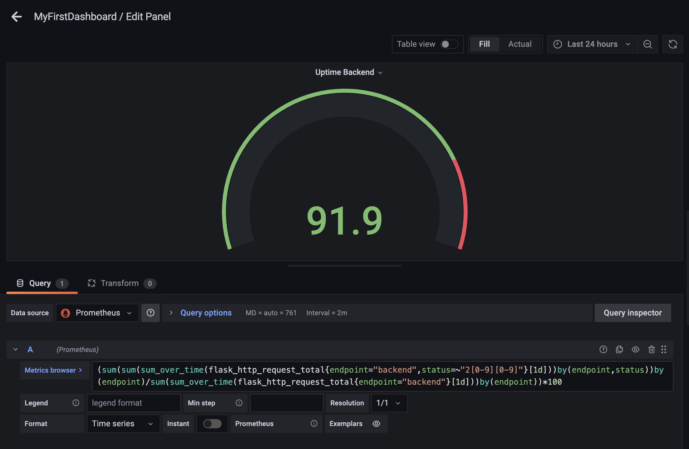
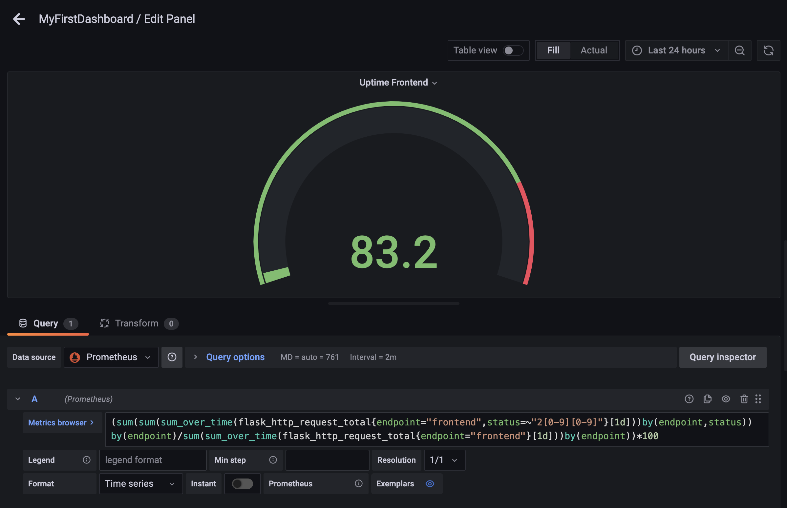
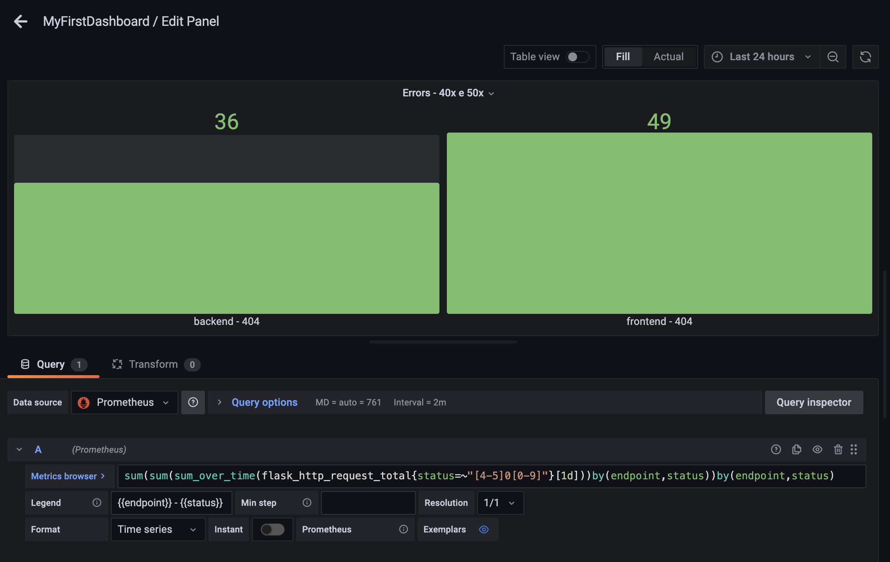
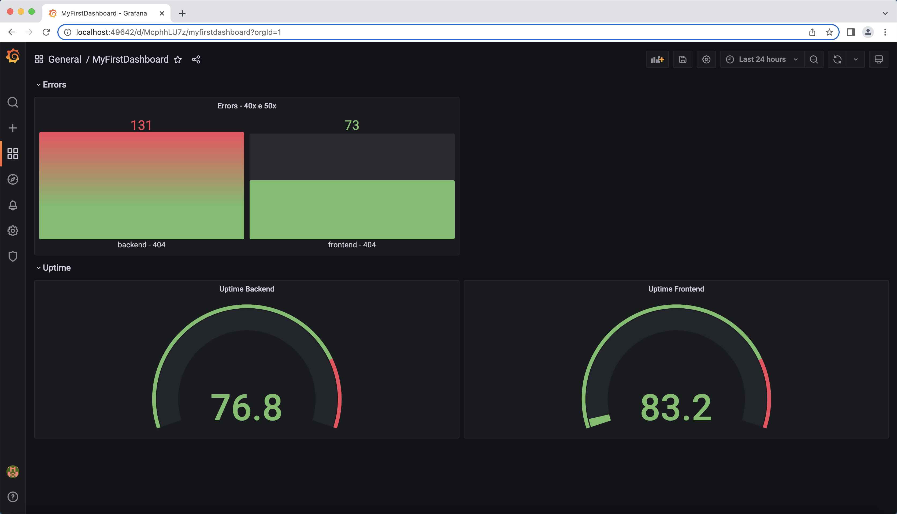

**Note:** For the screenshots, you can store all of your answer images in the `answer-img` directory.

## Verify the monitoring installation
### The Default namespace installation

### The Monitoring namespace installation

### The Observability namespace installation

## Setup the Jaeger and Prometheus source
### Grafana Home Page and Data Source Configuration

## Create a Basic Dashboard
### Simple Dashboard with Prometheus as a source

## Describe SLO/SLI
### Describe, in your own words, what the SLIs are, based on an SLO of *monthly uptime* and *request response time*.

SLI is an artifact that collects information and is used to measure availability.
SLIs could measure uptime, latency, or the proportion between success interactions for a specific period of time e.g. week, month; that means. We will aggregate interactions that don’t throw an exception or return an HTTP error or take more than a specific period of time to produce a result and define error policies as a playbook to reduce the likelihood or mitigate future problems.

## Creating SLI metrics.
### It is important to know why we want to measure certain metrics for our customer. Describe in detail 5 metrics to measure these SLIs. 
*TODO:*

## Create a Dashboard to measure our SLIs
### Dashboard Uptime Backend to 24hs

### Dashboard Uptime Frontend to 24hs

### Dashboards 40x and 50x Errors

### Dashboards Uptime and Errors

## Tracing our Flask App
### Trace Python Code - Part 1

### Trace Python Code - Part 2

### Jaeger in Panel

## Jaeger in Dashboards
### Dashboard Grafana as a Jaeger Source - Part 1

### Dashboard Grafana as a Jaeger Source - Part 2

## Report Error
*TODO:* Using the template below, write a trouble ticket for the developers, to explain the errors that you are seeing (400, 500, latency) and to let them know the file that is causing the issue also include a screenshot of the tracer span to demonstrate how we can user a tracer to locate errors easily.

### TROUBLE TICKET

- Name: Application temporary unavailable
- Date: 15/04/2022
- Subject: Service Unavailable
- Affected Area: Backend - /api
- Severity: 7.0 - High
- Description: The application is unstable and frequently showing the follow message: Service Unavailable. Please contact the System Admnistrator.

## Creating SLIs and SLOs
SLO: The Applications need to have a 99.95% uptime per month. 
SLI:
- CPU Saturation (Saturation)
- how many error messages we are seeing (Errors)
- how many success messages we are seeing (Success)
- Request Response time of the Apis (Latency)

## Building KPIs for our plan
1. SLI: Total successful http requests is more than or equal to 99.95% in a month
2. SLI: Total failing http requests is less than or equal to 0.05% in a month (40x and 50x)
3. SLI: The CPU usage up till 75%
4. SLI: The Memory usage up till 50%

## Final Dashboard
*TODO*: Create a Dashboard containing graphs that capture all the metrics of your KPIs and adequately representing your SLIs and SLOs. Include a screenshot of the dashboard here, and write a text description of what graphs are represented in the dashboard.  
