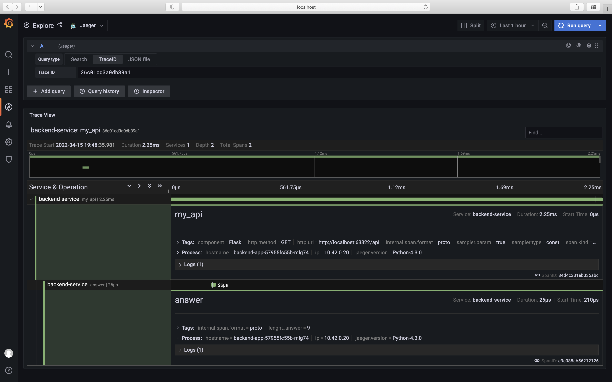
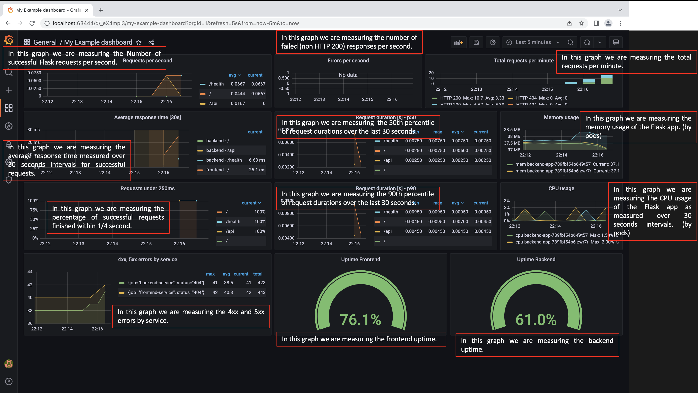

**Note:** For the screenshots, you can store all of your answer images in the `answer-img` directory.

## Verify the monitoring installation
### The Default namespace installation

### The Monitoring namespace installation

### The Observability namespace installation

## Setup the Jaeger and Prometheus source
### Grafana Home Page and Data Source Configuration

## Create a Basic Dashboard
### Simple Dashboard with Prometheus as a source

## Describe SLO/SLI
### Describe, in your own words, what the SLIs are, based on an SLO of *monthly uptime* and *request response time*.

SLI is an artifact that collects information and is used to measure availability.
SLIs could measure uptime, latency, or the proportion between success interactions for a specific period of time e.g. week, month; that means. We will aggregate interactions that don’t throw an exception or return an HTTP error or take more than a specific period of time to produce a result and define error policies as a playbook to reduce the likelihood or mitigate future problems.

## Creating SLI metrics.

- SLI Uptime = # Uptime in minutes / # Total minutes per period
- SLI Errors = # Requests different than 5XX / # Total requests per period 
- SLI Errors = # Requests different than 4XX / # Total requests per period
- SLI Latency = # Requests with latency < 1000ms / # Total Requests per period

SLI must help product owners find an easy way to understand and define an SLO, in that way would be much appropriate to work with latency in seconds or milliseconds rather than proportions.

- SLI Latency = Latency value for 99% of users.

## Create a Dashboard to measure our SLIs - Uptime and Response Time
### Dashboard Uptime and Response Time Over 1h - Frontend and Backend Service

### Dashboard Uptime and Response Time Over 24hs - Frontend and Backend Service

## Tracing our Flask App
### Trace Python Code - Part 1

### Trace Python Code - Part 2

### Jaeger in Panel

## Jaeger in Dashboards
### Dashboard Grafana as a Jaeger Source - Part 1

### Dashboard Grafana as a Jaeger Source - Part 2

## Report Error
### TROUBLE TICKET

- Name: Application temporary unavailable
- Date: 15/04/2022
- Subject: Service Unavailable
- Affected Area: Backend - /api
- Severity: 7.0 - High
- Description: The application is unstable and frequently showing the follow message: Service Unavailable. Please contact the System Admnistrator.

## Creating SLIs and SLOs
SLO: The Applications need to have a 99.95% uptime per month. 
SLI:
- CPU and Memory usage (Saturation)
- Error Rate: how many error messages we are seeing (Errors)
- Request Response time of the Apis (Latency < 10ms)
- Uptime >99.95%

## Building KPIs for our plan
- CPU and Memory usage (Saturation)
    a. CPU and Memory can not be usage above 80%, otherwise it will provoke application downtime.
    b. This metric will indicate to the infrastructure administrator necessity to trigger compute auto scaling.
- Error Rate
    a. This metric show how stable is the application in production.
    b. Total failing http requests is less than or equal to 0.05% in a month (40x and 50x)
- Latency < 10ms
    a. This metric show how API response time performance is good.
    b. We need to keep tracking of response time of the requests to avoid application instability.
- Uptime >99.95%
    a. This metric help monitoring application health and guarantee client satisfaction.
    b. This metric guarantee the company OKRs financial due to amount of time the application is live during  peak sales.

## Final Dashboard

